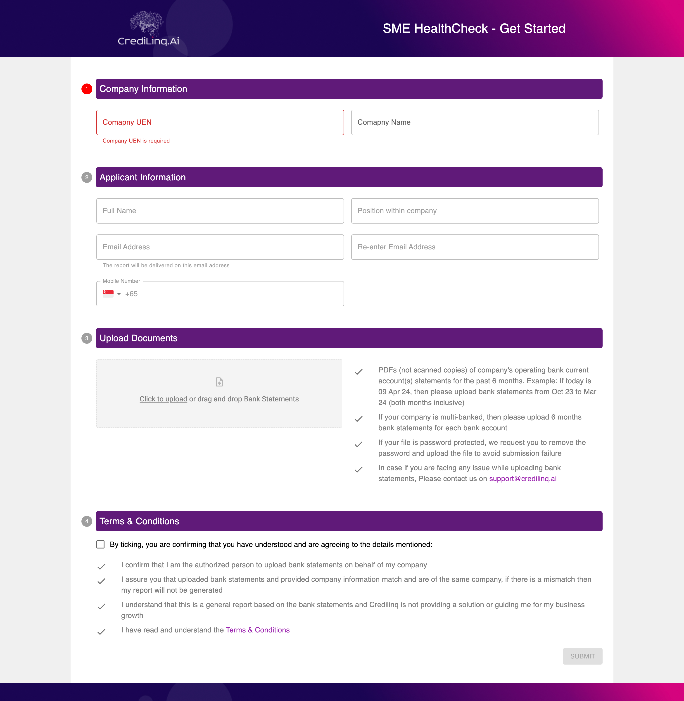

# Credilinq.AI Frontend using Next.Js
Clone of Credilinq SME HealthCheck page designed and developed using [Material UI](https://mui.com/) and [Next.js 14](https://nextjs.org/).

## UI Screenshot


## Clone
```bash
git clone https://github.com/abhidiwakar/credilinq-front.git
```


## Getting Started

#### 1. Install the dependencies:

```bash
npm install
# or
yarn install
# or
pnpm install
# or
bun install
```

#### 2. Create a `.env` file and paste content from `example.env` file in it.

#### 3. Run the development server:

```bash
npm run dev
# or
yarn dev
# or
pnpm dev
# or
bun dev
```

Open [http://localhost:3000](http://localhost:3000) with your browser to see the result.